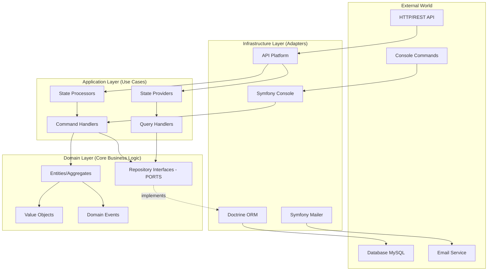
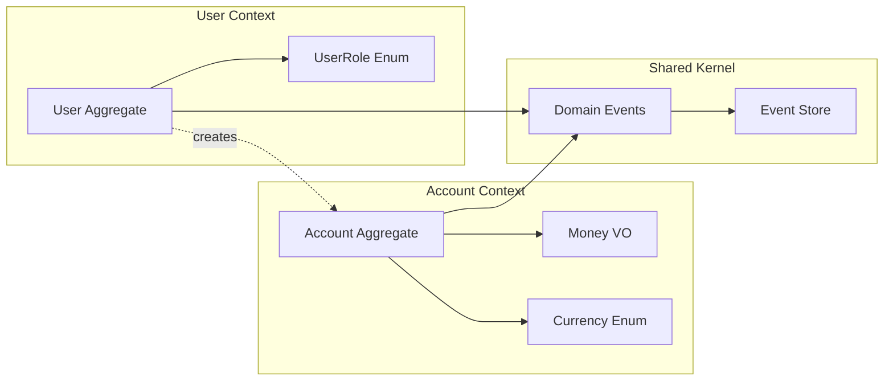
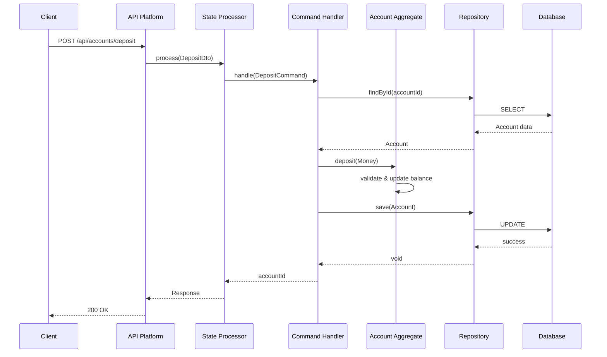
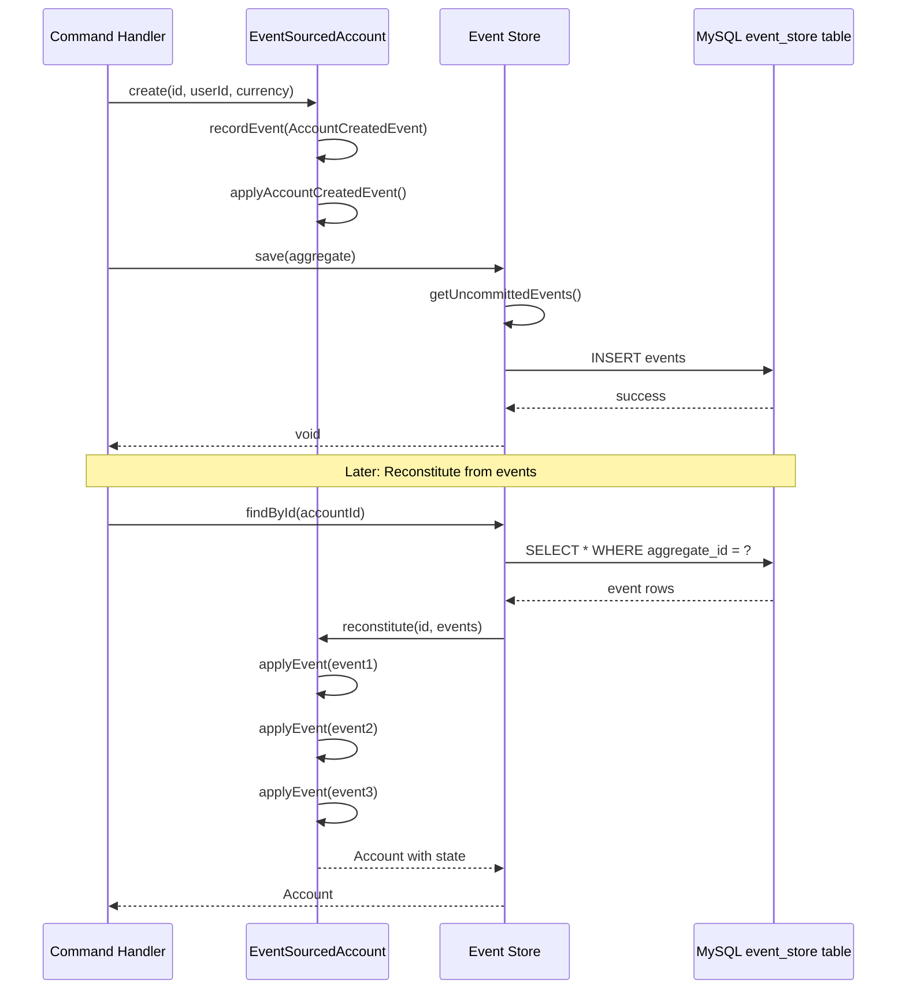
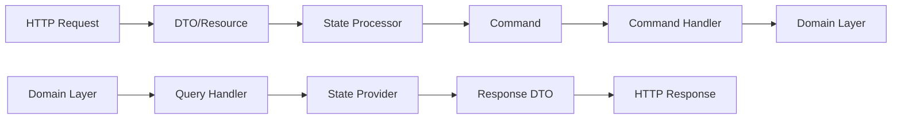
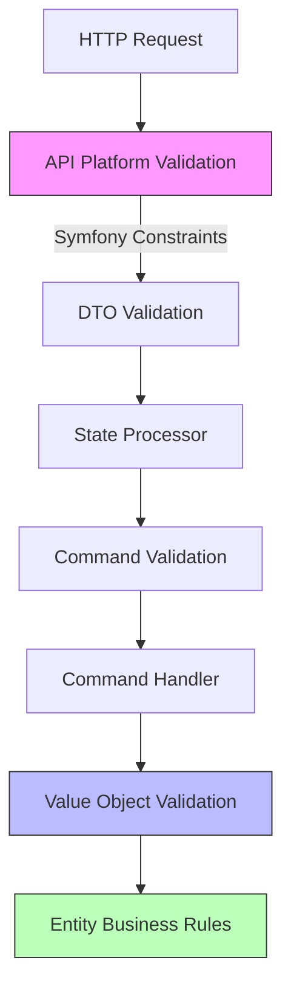
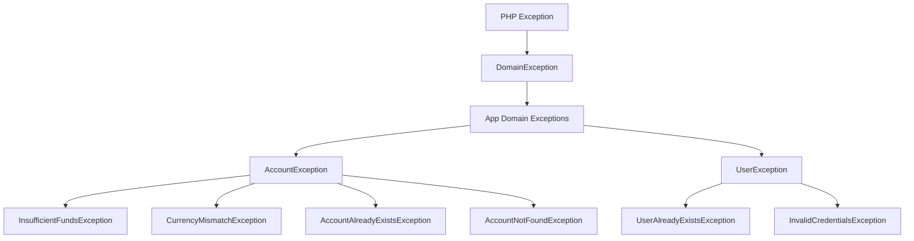
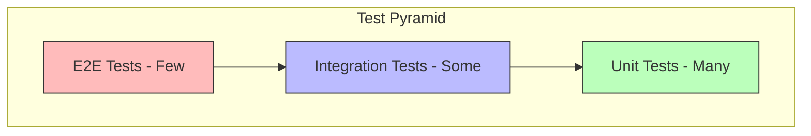
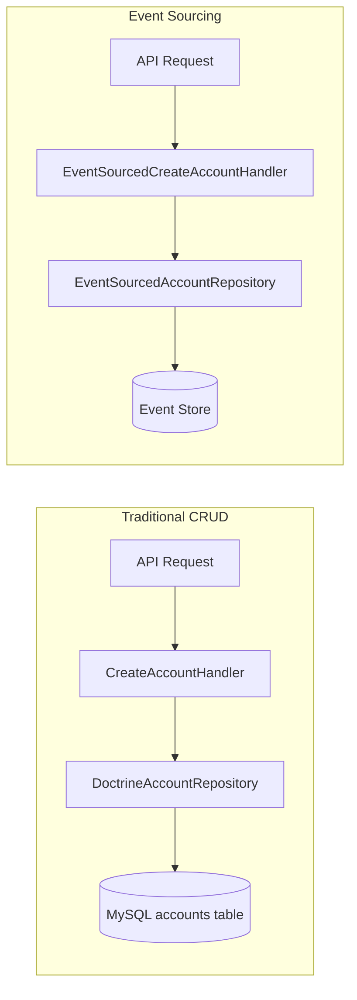

# Architecture Documentation

This document provides in-depth technical documentation of the **Domain-Driven Design (DDD)**, **CQRS**, **Event Sourcing**, and **Hexagonal Architecture** patterns implemented in this project.

> **💡 Quick Start**: For practical usage instructions, see [README.md](../README.md)

---

## 📚 Table of Contents

- [Hexagonal Architecture (Ports & Adapters)](#hexagonal-architecture-ports--adapters)
- [Domain-Driven Design Bounded Contexts](#domain-driven-design-bounded-contexts)
  - [Account Context](#account-context)
  - [User Context](#user-context)
  - [Shared Context](#shared-context)
- [CQRS (Command Query Responsibility Segregation)](#cqrs-command-query-responsibility-segregation)
  - [Commands (Write Operations)](#commands-write-operations)
  - [Queries (Read Operations)](#queries-read-operations)
- [Domain Model](#domain-model)
  - [Entities](#entities)
  - [Value Objects](#value-objects)
- [Repository Pattern](#repository-pattern)
- [Event Sourcing Implementation](#event-sourcing-implementation)
- [API Platform Integration](#api-platform-integration)
- [Validation Layers](#validation-layers)
- [Error Handling & Domain Exceptions](#error-handling--domain-exceptions)
- [Testing Strategy](#testing-strategy)
- [Performance & Optimization](#performance--optimization)
- [Migration Strategy (Dual-Write Pattern)](#migration-strategy-dual-write-pattern)
- [Extending the System](#extending-the-system)

---

## Hexagonal Architecture (Ports & Adapters)

### Overview

The project follows **Hexagonal Architecture** (also known as **Ports and Adapters**), which ensures the domain logic remains independent of external frameworks and technologies.



### Dependency Rule

**Critical Principle:** Dependencies always point **inward** (toward the domain).

```
Infrastructure → Application → Domain
     ↓              ↓            ✗
     ✓              ✓         (no outward dependencies)
```

✅ **Allowed:**
- Infrastructure depends on Application and Domain
- Application depends on Domain
- Domain depends on NOTHING external

❌ **Forbidden:**
- Domain depends on Infrastructure (database, framework)
- Domain depends on Application layer

### Ports (Interfaces)

**Location:** `src/{Context}/Domain/Repository/`

Ports are **interfaces** defined in the Domain layer that specify **what** the domain needs, without knowing **how** it's implemented.

```php
// PORT - Domain defines the contract
namespace App\Account\Domain\Repository;

interface AccountRepositoryInterface
{
    public function save(Account $account): void;
    public function findById(string $id): ?Account;
    public function findByUserIdAndCurrency(string $userId, Currency $currency): ?Account;
}
```

### Adapters (Implementations)

**Location:** `src/{Context}/Infrastructure/Repository/`

Adapters are **concrete implementations** in the Infrastructure layer that provide **how** the domain requirements are fulfilled.

```php
// ADAPTER - Infrastructure provides the implementation
namespace App\Account\Infrastructure\Repository;

class DoctrineAccountRepository implements AccountRepositoryInterface
{
    public function __construct(private EntityManagerInterface $em) {}

    public function save(Account $account): void
    {
        $this->em->persist($account);
        $this->em->flush();
    }
}
```

### Benefits

✅ **Testability** - Mock ports for unit tests
✅ **Flexibility** - Switch databases without changing domain
✅ **Independence** - Domain logic framework-agnostic
✅ **Maintainability** - Clear separation of concerns

---

## Domain-Driven Design Bounded Contexts



### Account Context

**Purpose:** Manages financial accounts, balances, and money operations

**Location:** `src/Account/`

**Key Components:**
- **Account Entity:** Core aggregate managing user balances
- **Money Value Object:** Immutable monetary amounts with currency
- **Currency Enum:** Supported currencies (UAH, USD)

**Example Usage:**
```php
// Creating an account
$account = new Account($accountId, $userId, Currency::UAH);

// Depositing money
$money = new Money('100.00', Currency::UAH);
$account->deposit($money);

// Withdrawing with validation
$account->withdraw(new Money('50.00', Currency::UAH));
```

**Business Rules:**
- One account per user per currency
- Negative balances not allowed
- Currency mismatch validation
- Immutable money operations

### User Context

**Purpose:** Handles authentication, authorization, and user management

**Location:** `src/User/`

**Key Components:**
- **User Entity:** Implements Symfony UserInterface
- **UserRole Enum:** Role-based access (USER, ADMIN)

**Example Usage:**
```php
// Creating a user
$user = new User($userId, 'user@example.com', $hashedPassword, UserRole::USER);

// Authentication integration
$roles = $user->getRoles(); // ['ROLE_USER']
$identifier = $user->getUserIdentifier(); // email
```

**Business Rules:**
- Unique email addresses
- Role-based authorization
- Secure password handling

### Shared Context

**Purpose:** Common interfaces and domain events used across contexts

**Location:** `src/Shared/`

**Key Components:**
- **DomainEvent Interface:** Contract for all domain events
- **Event Store:** Event Sourcing infrastructure
- **Common Value Objects:** Shared across contexts

**Example Usage:**
```php
// Domain event implementation
class AccountCreated implements DomainEvent
{
    public function getAggregateId(): string { return $this->accountId; }
    public function getEventType(): string { return 'account.created'; }
    public function getOccurredAt(): \DateTimeImmutable { return $this->occurredAt; }
}
```

---

## CQRS (Command Query Responsibility Segregation)



### Commands (Write Operations)

**Purpose:** Modify system state, enforce business rules

**Location:** `src/{Context}/Application/Command/`

**Structure:**
```php
// Command - Data Transfer Object
class CreateAccountCommand
{
    public function __construct(
        private string $userId,
        private Currency $currency
    ) {}

    public function getUserId(): string { return $this->userId; }
    public function getCurrency(): Currency { return $this->currency; }
}

// Handler - Business Logic
class CreateAccountHandler
{
    public function __construct(
        private AccountRepositoryInterface $accountRepository
    ) {}

    public function handle(CreateAccountCommand $command): string
    {
        // 1. Validate business rules
        $existingAccount = $this->accountRepository->findByUserIdAndCurrency(
            $command->getUserId(),
            $command->getCurrency()
        );

        if ($existingAccount) {
            throw new \DomainException('Account already exists');
        }

        // 2. Create aggregate
        $account = new Account(
            Uuid::uuid4()->toString(),
            $command->getUserId(),
            $command->getCurrency()
        );

        // 3. Persist changes
        $this->accountRepository->save($account);

        // 4. Return result
        return $account->getId();
    }
}
```

**Example Commands:**
- `CreateAccountCommand` - New account creation
- `DepositMoneyCommand` - Add funds to account
- `WithdrawMoneyCommand` - Remove funds from account
- `TransferMoneyCommand` - Move money between accounts

### Queries (Read Operations)

**Purpose:** Retrieve data without side effects

**Location:** `src/{Context}/Application/Query/`

**Structure:**
```php
// Query - Request specification
class GetAccountBalanceQuery
{
    public function __construct(
        private string $accountId
    ) {}

    public function getAccountId(): string { return $this->accountId; }
}

// Handler - Data retrieval
class GetAccountBalanceHandler
{
    public function __construct(
        private AccountRepositoryInterface $accountRepository
    ) {}

    public function handle(GetAccountBalanceQuery $query): ?AccountBalanceResponse
    {
        // 1. Fetch data
        $account = $this->accountRepository->findById($query->getAccountId());

        if (!$account) {
            return null;
        }

        // 2. Transform to read model
        return new AccountBalanceResponse(
            accountId: $account->getId(),
            balance: $account->getBalance(),
            currency: $account->getCurrency()->value,
            updatedAt: $account->getUpdatedAt()
        );
    }
}
```

### Benefits

✅ **Separation of Concerns** - Read/write operations isolated
✅ **Performance** - Optimized queries vs. business logic
✅ **Scalability** - Different scaling strategies for reads/writes
✅ **Complexity Management** - Simple, focused handlers

---

## Domain Model

### Entities

**Purpose:** Objects with identity that can change over time

**Characteristics:**
- Unique identifier (UUID)
- Mutable state
- Business logic encapsulation
- Lifecycle management

**Example - Account Entity:**
```php
class Account
{
    private string $id;           // Identity
    private string $userId;       // Reference
    private Currency $currency;   // Value Object
    private string $balance;      // State
    private \DateTimeImmutable $createdAt;
    private \DateTimeImmutable $updatedAt;

    public function __construct(string $id, string $userId, Currency $currency)
    {
        $this->id = $id;
        $this->userId = $userId;
        $this->currency = $currency;
        $this->balance = '0.00';
        $this->createdAt = new \DateTimeImmutable();
        $this->updatedAt = new \DateTimeImmutable();
    }

    public function deposit(Money $amount): void
    {
        // Business rule validation
        if (!$amount->getCurrency()->equals($this->currency)) {
            throw new \InvalidArgumentException('Currency mismatch');
        }

        // State modification
        $this->balance = bcadd($this->balance, $amount->getAmount(), 2);
        $this->updatedAt = new \DateTimeImmutable();
    }

    public function withdraw(Money $amount): void
    {
        // Business rule validation
        if (!$amount->getCurrency()->equals($this->currency)) {
            throw new \InvalidArgumentException('Currency mismatch');
        }

        if (bccomp($this->balance, $amount->getAmount(), 2) < 0) {
            throw new InsufficientFundsException('Insufficient funds');
        }

        // State modification
        $this->balance = bcsub($this->balance, $amount->getAmount(), 2);
        $this->updatedAt = new \DateTimeImmutable();
    }
}
```

### Value Objects

**Purpose:** Immutable objects representing concepts without identity

**Characteristics:**
- No identity (equality by value)
- Immutable (thread-safe)
- Self-validating
- Domain concept representation

**Example - Money Value Object:**
```php
class Money
{
    private string $amount;
    private Currency $currency;

    public function __construct(string $amount, Currency $currency)
    {
        // Self-validation
        if (bccomp($amount, '0', 2) < 0) {
            throw new \InvalidArgumentException('Amount cannot be negative');
        }

        $this->amount = $amount;
        $this->currency = $currency;
    }

    public function add(Money $other): Money
    {
        // Immutable operations
        if (!$this->currency->equals($other->currency)) {
            throw new \InvalidArgumentException('Currency mismatch');
        }

        return new Money(
            bcadd($this->amount, $other->amount, 2),
            $this->currency
        );
    }

    public function getAmount(): string
    {
        return $this->amount;
    }

    public function getCurrency(): Currency
    {
        return $this->currency;
    }
}
```

**Example - Currency Enum:**
```php
enum Currency: string
{
    case UAH = 'UAH';
    case USD = 'USD';
    case EUR = 'EUR';

    public function equals(Currency $other): bool
    {
        return $this->value === $other->value;
    }

    public function getSymbol(): string
    {
        return match($this) {
            self::UAH => '₴',
            self::USD => '$',
            self::EUR => '€',
        };
    }
}
```

### Benefits

✅ **Data Integrity** - Self-validating objects
✅ **Thread Safety** - Immutable by design
✅ **Expressiveness** - Domain concepts as first-class objects
✅ **Reusability** - Shareable across contexts
✅ **Type Safety** - Compiler-enforced constraints

---

## Repository Pattern

### Interface (Port)

**Purpose:** Define data access contract in domain layer

**Location:** `src/{Context}/Domain/Repository/`

```php
namespace App\Account\Domain\Repository;

interface AccountRepositoryInterface
{
    public function save(Account $account): void;
    public function findById(string $id): ?Account;
    public function findByUserIdAndCurrency(string $userId, Currency $currency): ?Account;
    public function findByUserId(string $userId): array;
}
```

### Implementation (Adapter)

**Purpose:** Concrete data access using specific technology

**Location:** `src/{Context}/Infrastructure/Repository/`

```php
namespace App\Account\Infrastructure\Repository;

use Doctrine\Bundle\DoctrineBundle\Repository\ServiceEntityRepository;
use Doctrine\Persistence\ManagerRegistry;

class DoctrineAccountRepository extends ServiceEntityRepository implements AccountRepositoryInterface
{
    public function __construct(ManagerRegistry $registry)
    {
        parent::__construct($registry, Account::class);
    }

    public function save(Account $account): void
    {
        $this->getEntityManager()->persist($account);
        $this->getEntityManager()->flush();
    }

    public function findByUserIdAndCurrency(string $userId, Currency $currency): ?Account
    {
        return $this->findOneBy([
            'userId' => $userId,
            'currency' => $currency
        ]);
    }

    public function findByUserId(string $userId): array
    {
        return $this->findBy(['userId' => $userId]);
    }
}
```

### Usage in Application Layer

```php
class CreateAccountHandler
{
    public function __construct(
        private AccountRepositoryInterface $accountRepository
    ) {}

    public function handle(CreateAccountCommand $command): string
    {
        // Check business rules
        $existingAccount = $this->accountRepository->findByUserIdAndCurrency(
            $command->getUserId(),
            $command->getCurrency()
        );

        if ($existingAccount) {
            throw new AccountAlreadyExistsException('Account already exists for this currency');
        }

        // Create and save
        $account = new Account(
            Uuid::uuid4()->toString(),
            $command->getUserId(),
            $command->getCurrency()
        );

        $this->accountRepository->save($account);

        return $account->getId();
    }
}
```

### Benefits

✅ **Testability** - Mock repositories for unit tests
✅ **Technology Independence** - Domain doesn't know about database
✅ **Flexibility** - Easy to switch data storage (SQL → NoSQL → Event Store)
✅ **Clean Architecture** - Dependency inversion principle

---

## Event Sourcing Implementation

### Overview

The project implements **Event Sourcing** pattern alongside traditional CRUD operations, providing a complete audit trail of all state changes and enabling powerful capabilities like event replay, time travel debugging, and complex business analytics.



### Event Store Architecture

#### Core Components

**Event Store Interface:**
```php
namespace App\Shared\Infrastructure\EventStore;

interface EventStoreInterface
{
    public function saveEvents(string $aggregateId, array $events, int $expectedVersion): void;
    public function getEventsForAggregate(string $aggregateId): array;
    public function getEventsForAggregateFromVersion(string $aggregateId, int $version): array;
    public function getAllEvents(): array;
    public function getEventsByType(string $eventType): array;
}
```

**Event Store Implementation:**
- **Location:** `src/Shared/Infrastructure/EventStore/DoctrineEventStore.php`
- **Storage:** MySQL with optimized indexes
- **Features:** Optimistic concurrency control, event versioning, JSON serialization
- **Performance:** Composite indexes on aggregate_id, event_type, and occurred_at

#### Database Schema

```sql
CREATE TABLE event_store (
    id BIGINT AUTO_INCREMENT PRIMARY KEY,
    aggregate_id VARCHAR(255) NOT NULL,
    event_type VARCHAR(255) NOT NULL,
    event_data JSON NOT NULL,
    version INT NOT NULL,
    occurred_at DATETIME NOT NULL,
    INDEX idx_aggregate_id (aggregate_id),
    INDEX idx_event_type (event_type),
    INDEX idx_occurred_at (occurred_at),
    UNIQUE KEY unique_aggregate_version (aggregate_id, version)
);
```

### Domain Events

#### Event Base Classes

```php
namespace App\Shared\Domain\Event;

abstract class AbstractDomainEvent implements DomainEventInterface
{
    private \DateTimeImmutable $occurredAt;
    private int $version;

    public function __construct()
    {
        $this->occurredAt = new \DateTimeImmutable();
    }

    public function getEventType(): string
    {
        return static::class;
    }

    public function getOccurredAt(): \DateTimeImmutable
    {
        return $this->occurredAt;
    }

    abstract public function getAggregateId(): string;
    abstract public function getEventData(): array;
}
```

#### Account Domain Events

**AccountCreatedEvent:**
```php
namespace App\Account\Domain\Event;

class AccountCreatedEvent extends AbstractDomainEvent
{
    public function __construct(
        private string $accountId,
        private string $userId,
        private Currency $currency
    ) {
        parent::__construct();
    }

    public function getAggregateId(): string
    {
        return $this->accountId;
    }

    public function getEventData(): array
    {
        return [
            'accountId' => $this->accountId,
            'userId' => $this->userId,
            'currency' => $this->currency->value,
        ];
    }
}
```

**MoneyDepositedEvent:**
```php
class MoneyDepositedEvent extends AbstractDomainEvent
{
    public function __construct(
        private string $accountId,
        private Money $amount,
        private string $newBalance
    ) {
        parent::__construct();
    }

    public function getAggregateId(): string
    {
        return $this->accountId;
    }

    public function getEventData(): array
    {
        return [
            'accountId' => $this->accountId,
            'amount' => $this->amount->getAmount(),
            'currency' => $this->amount->getCurrency()->value,
            'newBalance' => $this->newBalance,
        ];
    }
}
```

**MoneyWithdrawnEvent:**
```php
class MoneyWithdrawnEvent extends AbstractDomainEvent
{
    public function __construct(
        private string $accountId,
        private Money $amount,
        private string $newBalance
    ) {
        parent::__construct();
    }

    public function getAggregateId(): string
    {
        return $this->accountId;
    }

    public function getEventData(): array
    {
        return [
            'accountId' => $this->accountId,
            'amount' => $this->amount->getAmount(),
            'currency' => $this->amount->getCurrency()->value,
            'newBalance' => $this->newBalance,
        ];
    }
}
```

### Event-Sourced Aggregates

#### Abstract Aggregate Root

```php
namespace App\Shared\Domain;

abstract class AbstractAggregateRoot implements AggregateRootInterface
{
    private string $id;
    private int $version = 0;
    private array $uncommittedEvents = [];

    protected function recordEvent(DomainEventInterface $event): void
    {
        $this->uncommittedEvents[] = $event;
        $this->applyEvent($event);
    }

    public function applyEvent(DomainEventInterface $event): void
    {
        $this->version++;
        $this->when($event);
    }

    protected function when(DomainEventInterface $event): void
    {
        $method = $this->getEventHandlerMethod($event);

        if (method_exists($this, $method)) {
            $this->$method($event);
        }
    }

    private function getEventHandlerMethod(DomainEventInterface $event): string
    {
        $classParts = explode('\\', get_class($event));
        $className = end($classParts);
        return 'apply' . $className;
    }

    public static function reconstitute(string $id, array $events): static
    {
        $reflectionClass = new \ReflectionClass(static::class);
        $instance = $reflectionClass->newInstanceWithoutConstructor();
        $instance->id = $id;
        $instance->version = 0;
        $instance->uncommittedEvents = [];

        foreach ($events as $event) {
            $instance->applyEvent($event);
        }

        return $instance;
    }

    public function getUncommittedEvents(): array
    {
        return $this->uncommittedEvents;
    }

    public function markEventsAsCommitted(): void
    {
        $this->uncommittedEvents = [];
    }

    public function getId(): string
    {
        return $this->id;
    }

    public function getVersion(): int
    {
        return $this->version;
    }
}
```

#### EventSourcedAccount Aggregate

```php
namespace App\Account\Domain\Entity;

class EventSourcedAccount extends AbstractAggregateRoot
{
    private string $userId;
    private Currency $currency;
    private string $balance;
    private \DateTimeImmutable $createdAt;
    private \DateTimeImmutable $updatedAt;

    public static function create(string $accountId, string $userId, Currency $currency): self
    {
        $account = new self();
        $account->id = $accountId;
        $account->recordEvent(new AccountCreatedEvent($accountId, $userId, $currency));
        return $account;
    }

    public function deposit(Money $amount): void
    {
        if (!$amount->getCurrency()->equals($this->currency)) {
            throw new CurrencyMismatchException('Currency mismatch');
        }

        $newBalance = bcadd($this->balance, $amount->getAmount(), 2);
        $this->recordEvent(new MoneyDepositedEvent($this->getId(), $amount, $newBalance));
    }

    public function withdraw(Money $amount): void
    {
        if (!$amount->getCurrency()->equals($this->currency)) {
            throw new CurrencyMismatchException('Currency mismatch');
        }

        if (bccomp($this->balance, $amount->getAmount(), 2) < 0) {
            throw new InsufficientFundsException('Insufficient funds');
        }

        $newBalance = bcsub($this->balance, $amount->getAmount(), 2);
        $this->recordEvent(new MoneyWithdrawnEvent($this->getId(), $amount, $newBalance));
    }

    protected function applyAccountCreatedEvent(AccountCreatedEvent $event): void
    {
        $this->userId = $event->getUserId();
        $this->currency = $event->getCurrency();
        $this->balance = '0.00';
        $this->createdAt = $event->getOccurredAt();
        $this->updatedAt = $event->getOccurredAt();
    }

    protected function applyMoneyDepositedEvent(MoneyDepositedEvent $event): void
    {
        $this->balance = $event->getNewBalance();
        $this->updatedAt = $event->getOccurredAt();
    }

    protected function applyMoneyWithdrawnEvent(MoneyWithdrawnEvent $event): void
    {
        $this->balance = $event->getNewBalance();
        $this->updatedAt = $event->getOccurredAt();
    }
}
```

### Event Sourcing Benefits

✅ **Complete Audit Trail** - Every state change recorded as event
✅ **Event Replay** - Reconstruct aggregate state from events
✅ **Time Travel** - Debug by replaying events to any point
✅ **Business Intelligence** - Rich event data for analytics
✅ **Scalability** - Append-only event store optimized for writes

---

## API Platform Integration

### Overview

**API Platform** serves as the **HTTP adapter** in our Hexagonal Architecture, translating HTTP requests into Commands/Queries and domain responses back to HTTP.



### State Processors (Commands)

**Purpose:** Handle write operations (POST, PUT, PATCH, DELETE)

**Location:** `src/{Context}/Infrastructure/ApiPlatform/StateProcessor/`

```php
namespace App\Account\Infrastructure\ApiPlatform\StateProcessor;

use ApiPlatform\Metadata\Operation;
use ApiPlatform\State\ProcessorInterface;

class DepositMoneyProcessor implements ProcessorInterface
{
    public function __construct(
        private DepositMoneyHandler $depositMoneyHandler
    ) {}

    public function process(mixed $data, Operation $operation, array $uriVariables = [], array $context = []): mixed
    {
        // 1. Extract data from DTO
        $accountId = $uriVariables['id'];
        $amount = $data->amount;
        $currency = Currency::from($data->currency);

        // 2. Create command
        $command = new DepositMoneyCommand(
            accountId: $accountId,
            amount: $amount,
            currency: $currency
        );

        // 3. Execute command handler
        $this->depositMoneyHandler->handle($command);

        // 4. Return response (or fetch updated resource)
        return $data;
    }
}
```

### State Providers (Queries)

**Purpose:** Handle read operations (GET)

**Location:** `src/{Context}/Infrastructure/ApiPlatform/StateProvider/`

```php
namespace App\Account\Infrastructure\ApiPlatform\StateProvider;

use ApiPlatform\Metadata\Operation;
use ApiPlatform\State\ProviderInterface;

class AccountBalanceProvider implements ProviderInterface
{
    public function __construct(
        private GetAccountBalanceHandler $getAccountBalanceHandler
    ) {}

    public function provide(Operation $operation, array $uriVariables = [], array $context = []): object|array|null
    {
        // 1. Extract parameters
        $accountId = $uriVariables['id'];

        // 2. Create query
        $query = new GetAccountBalanceQuery($accountId);

        // 3. Execute query handler
        $accountBalance = $this->getAccountBalanceHandler->handle($query);

        if (!$accountBalance) {
            return null;
        }

        // 4. Transform to API Platform resource
        return new AccountBalanceResponse(
            accountId: $accountBalance->getAccountId(),
            balance: $accountBalance->getBalance(),
            currency: $accountBalance->getCurrency(),
            lastUpdated: $accountBalance->getUpdatedAt()
        );
    }
}
```

### DTOs (Data Transfer Objects)

**Purpose:** Define API contract, separate from domain model

**Location:** `src/{Context}/Infrastructure/ApiPlatform/Dto/`

```php
namespace App\Account\Infrastructure\ApiPlatform\Dto;

use ApiPlatform\Metadata\ApiResource;
use ApiPlatform\Metadata\Post;
use Symfony\Component\Validator\Constraints as Assert;

#[ApiResource(
    operations: [
        new Post(
            uriTemplate: '/accounts/{id}/deposit',
            processor: DepositMoneyProcessor::class
        )
    ]
)]
class DepositMoneyDto
{
    #[Assert\NotBlank]
    #[Assert\Positive]
    #[Assert\Regex(pattern: '/^\d+\.\d{2}$/', message: 'Amount must have exactly 2 decimal places')]
    public string $amount;

    #[Assert\NotBlank]
    #[Assert\Choice(choices: ['UAH', 'USD', 'EUR'])]
    public string $currency;
}
```

### Resource Configuration

```php
namespace App\Account\Domain\Entity;

use ApiPlatform\Metadata\ApiResource;
use ApiPlatform\Metadata\Get;
use ApiPlatform\Metadata\Post;

#[ApiResource(
    operations: [
        new Get(
            uriTemplate: '/accounts/{id}',
            provider: AccountBalanceProvider::class
        ),
        new Post(
            uriTemplate: '/accounts',
            processor: CreateAccountProcessor::class
        ),
        new Post(
            uriTemplate: '/accounts/{id}/deposit',
            processor: DepositMoneyProcessor::class,
            input: DepositMoneyDto::class
        ),
        new Post(
            uriTemplate: '/accounts/{id}/withdraw',
            processor: WithdrawMoneyProcessor::class,
            input: WithdrawMoneyDto::class
        )
    ]
)]
class Account
{
    // Domain entity...
}
```

### Benefits

✅ **Separation** - API layer separate from domain
✅ **Validation** - Input validated before reaching domain
✅ **Documentation** - Auto-generated OpenAPI/Swagger
✅ **Flexibility** - Change API without changing domain

---

## Validation Layers

The application implements **multi-layer validation** to ensure data integrity at every level.



### Layer 1: API Platform Validation (HTTP)

**Purpose:** Validate HTTP input before domain processing

**Location:** DTO classes with Symfony Constraints

```php
use Symfony\Component\Validator\Constraints as Assert;

class CreateAccountDto
{
    #[Assert\NotBlank(message: 'User ID is required')]
    #[Assert\Uuid(message: 'User ID must be a valid UUID')]
    public string $userId;

    #[Assert\NotBlank(message: 'Currency is required')]
    #[Assert\Choice(
        choices: ['UAH', 'USD', 'EUR'],
        message: 'Currency must be one of: {{ choices }}'
    )]
    public string $currency;
}
```

**Errors returned:** HTTP 422 Unprocessable Entity with validation errors

### Layer 2: Command Validation (Application)

**Purpose:** Validate command data before execution

**Location:** Command classes (optional, basic validation)

```php
class DepositMoneyCommand
{
    public function __construct(
        private string $accountId,
        private string $amount,
        private Currency $currency
    ) {
        // Basic validation
        if (empty($accountId)) {
            throw new \InvalidArgumentException('Account ID cannot be empty');
        }

        if (bccomp($amount, '0', 2) <= 0) {
            throw new \InvalidArgumentException('Amount must be positive');
        }
    }
}
```

### Layer 3: Value Object Validation (Domain)

**Purpose:** Self-validating domain concepts

**Location:** Value Object constructors

```php
class Money
{
    public function __construct(
        private string $amount,
        private Currency $currency
    ) {
        // Domain validation
        if (!preg_match('/^\d+\.\d{2}$/', $amount)) {
            throw new \InvalidArgumentException(
                'Amount must have exactly 2 decimal places'
            );
        }

        if (bccomp($amount, '0', 2) < 0) {
            throw new \InvalidArgumentException(
                'Amount cannot be negative'
            );
        }

        if (bccomp($amount, '999999999.99', 2) > 0) {
            throw new \InvalidArgumentException(
                'Amount exceeds maximum allowed value'
            );
        }
    }
}
```

### Layer 4: Entity Business Rules (Domain)

**Purpose:** Enforce business invariants

**Location:** Entity methods

```php
class Account
{
    public function withdraw(Money $amount): void
    {
        // Business rule: Currency must match
        if (!$amount->getCurrency()->equals($this->currency)) {
            throw new CurrencyMismatchException(
                "Cannot withdraw {$amount->getCurrency()->value} from {$this->currency->value} account"
            );
        }

        // Business rule: Sufficient funds required
        if (bccomp($this->balance, $amount->getAmount(), 2) < 0) {
            throw new InsufficientFundsException(
                "Insufficient funds. Balance: {$this->balance}, Requested: {$amount->getAmount()}"
            );
        }

        $this->balance = bcsub($this->balance, $amount->getAmount(), 2);
        $this->updatedAt = new \DateTimeImmutable();
    }
}
```

### Validation Strategy Summary

| Layer | Purpose | Location | Example |
|-------|---------|----------|---------|
| **HTTP** | Input format | DTO | Email format, required fields |
| **Command** | Basic invariants | Command constructor | Non-empty IDs, positive amounts |
| **Value Object** | Domain concepts | VO constructor | Money format, currency rules |
| **Entity** | Business rules | Entity methods | Sufficient funds, currency match |

---

## Error Handling & Domain Exceptions

### Exception Hierarchy



### Domain Exception Examples

**Base Domain Exception:**
```php
namespace App\Shared\Domain\Exception;

abstract class DomainException extends \DomainException
{
    public function __construct(
        string $message,
        int $code = 0,
        ?\Throwable $previous = null
    ) {
        parent::__construct($message, $code, $previous);
    }
}
```

**Account-Specific Exceptions:**
```php
namespace App\Account\Domain\Exception;

class InsufficientFundsException extends DomainException
{
    public static function forWithdrawal(string $balance, string $requested): self
    {
        return new self(
            "Insufficient funds. Available: {$balance}, Requested: {$requested}"
        );
    }
}

class CurrencyMismatchException extends DomainException
{
    public static function forDeposit(Currency $accountCurrency, Currency $depositCurrency): self
    {
        return new self(
            "Currency mismatch. Account: {$accountCurrency->value}, Deposit: {$depositCurrency->value}"
        );
    }
}

class AccountAlreadyExistsException extends DomainException
{
    public static function forUserAndCurrency(string $userId, Currency $currency): self
    {
        return new self(
            "Account already exists for user {$userId} with currency {$currency->value}"
        );
    }
}
```

### Exception Handling in Application Layer

```php
class CreateAccountHandler
{
    public function handle(CreateAccountCommand $command): string
    {
        $existingAccount = $this->accountRepository->findByUserIdAndCurrency(
            $command->getUserId(),
            $command->getCurrency()
        );

        if ($existingAccount) {
            throw AccountAlreadyExistsException::forUserAndCurrency(
                $command->getUserId(),
                $command->getCurrency()
            );
        }

        // ... create account
    }
}
```

### HTTP Error Mapping

**Event Subscriber for Domain Exceptions:**
```php
namespace App\Infrastructure\ApiPlatform\EventSubscriber;

use Symfony\Component\EventDispatcher\EventSubscriberInterface;
use Symfony\Component\HttpKernel\Event\ExceptionEvent;
use Symfony\Component\HttpKernel\KernelEvents;
use Symfony\Component\HttpFoundation\JsonResponse;

class DomainExceptionSubscriber implements EventSubscriberInterface
{
    public static function getSubscribedEvents(): array
    {
        return [
            KernelEvents::EXCEPTION => 'onKernelException',
        ];
    }

    public function onKernelException(ExceptionEvent $event): void
    {
        $exception = $event->getThrowable();

        $response = match (true) {
            $exception instanceof AccountAlreadyExistsException => new JsonResponse(
                ['error' => $exception->getMessage()],
                JsonResponse::HTTP_CONFLICT
            ),
            $exception instanceof AccountNotFoundException => new JsonResponse(
                ['error' => $exception->getMessage()],
                JsonResponse::HTTP_NOT_FOUND
            ),
            $exception instanceof InsufficientFundsException,
            $exception instanceof CurrencyMismatchException => new JsonResponse(
                ['error' => $exception->getMessage()],
                JsonResponse::HTTP_BAD_REQUEST
            ),
            $exception instanceof DomainException => new JsonResponse(
                ['error' => $exception->getMessage()],
                JsonResponse::HTTP_UNPROCESSABLE_ENTITY
            ),
            default => null,
        };

        if ($response) {
            $event->setResponse($response);
        }
    }
}
```

### Exception Strategy

| Exception Type | HTTP Status | When to Use |
|----------------|-------------|-------------|
| `AccountAlreadyExistsException` | 409 Conflict | Duplicate resource creation |
| `AccountNotFoundException` | 404 Not Found | Resource not found |
| `InsufficientFundsException` | 400 Bad Request | Business rule violation |
| `CurrencyMismatchException` | 400 Bad Request | Invalid operation parameters |
| `InvalidArgumentException` | 422 Unprocessable Entity | Invalid input data |
| Generic `DomainException` | 422 Unprocessable Entity | Generic domain errors |

---

## Testing Strategy

### Test Pyramid



### 1. Unit Tests (Domain Layer)

**Purpose:** Test business logic in isolation

**Location:** `tests/Unit/{Context}/Domain/`

#### Testing Value Objects

```php
namespace App\Tests\Unit\Account\Domain\ValueObject;

use PHPUnit\Framework\TestCase;
use App\Account\Domain\ValueObject\Money;
use App\Account\Domain\ValueObject\Currency;

class MoneyTest extends TestCase
{
    public function testMoneyCreation(): void
    {
        $money = new Money('100.50', Currency::UAH);

        $this->assertEquals('100.50', $money->getAmount());
        $this->assertEquals(Currency::UAH, $money->getCurrency());
    }

    public function testMoneyAddition(): void
    {
        $money1 = new Money('100.50', Currency::UAH);
        $money2 = new Money('50.25', Currency::UAH);

        $result = $money1->add($money2);

        $this->assertEquals('150.75', $result->getAmount());
    }

    public function testNegativeAmountThrowsException(): void
    {
        $this->expectException(\InvalidArgumentException::class);
        $this->expectExceptionMessage('Amount cannot be negative');

        new Money('-10.00', Currency::UAH);
    }

    public function testCurrencyMismatchThrowsException(): void
    {
        $this->expectException(\InvalidArgumentException::class);
        $this->expectExceptionMessage('Currency mismatch');

        $money1 = new Money('100.00', Currency::UAH);
        $money2 = new Money('50.00', Currency::USD);

        $money1->add($money2);
    }
}
```

#### Testing Entities

```php
namespace App\Tests\Unit\Account\Domain\Entity;

use PHPUnit\Framework\TestCase;
use App\Account\Domain\Entity\Account;
use App\Account\Domain\ValueObject\Money;
use App\Account\Domain\ValueObject\Currency;

class AccountTest extends TestCase
{
    private Account $account;

    protected function setUp(): void
    {
        $this->account = new Account(
            id: 'test-account-id',
            userId: 'test-user-id',
            currency: Currency::UAH
        );
    }

    public function testAccountCreation(): void
    {
        $this->assertEquals('test-account-id', $this->account->getId());
        $this->assertEquals('test-user-id', $this->account->getUserId());
        $this->assertEquals(Currency::UAH, $this->account->getCurrency());
        $this->assertEquals('0.00', $this->account->getBalance());
    }

    public function testDeposit(): void
    {
        $money = new Money('100.50', Currency::UAH);
        $this->account->deposit($money);

        $this->assertEquals('100.50', $this->account->getBalance());
    }

    public function testWithdraw(): void
    {
        $this->account->deposit(new Money('100.00', Currency::UAH));
        $this->account->withdraw(new Money('30.25', Currency::UAH));

        $this->assertEquals('69.75', $this->account->getBalance());
    }

    public function testInsufficientFundsThrowsException(): void
    {
        $this->expectException(InsufficientFundsException::class);

        $this->account->withdraw(new Money('100.00', Currency::UAH));
    }

    public function testCurrencyMismatchOnDepositThrowsException(): void
    {
        $this->expectException(CurrencyMismatchException::class);

        $this->account->deposit(new Money('100.00', Currency::USD));
    }
}
```

### 2. Application Layer Tests (Command Handlers)

**Location:** `tests/Unit/{Context}/Application/Handler/`

```php
namespace App\Tests\Unit\Account\Application\Handler;

use PHPUnit\Framework\TestCase;
use App\Account\Application\Command\CreateAccountCommand;
use App\Account\Application\Handler\CreateAccountHandler;
use App\Account\Domain\Repository\AccountRepositoryInterface;
use App\Account\Domain\ValueObject\Currency;

class CreateAccountHandlerTest extends TestCase
{
    public function testHandleCreatesAccount(): void
    {
        // Mock repository
        $repository = $this->createMock(AccountRepositoryInterface::class);
        $repository->expects($this->once())
            ->method('findByUserIdAndCurrency')
            ->willReturn(null);
        $repository->expects($this->once())
            ->method('save');

        // Create handler
        $handler = new CreateAccountHandler($repository);

        // Execute
        $command = new CreateAccountCommand('user-id', Currency::UAH);
        $accountId = $handler->handle($command);

        // Assert
        $this->assertNotEmpty($accountId);
    }

    public function testHandleThrowsExceptionWhenAccountExists(): void
    {
        // Mock existing account
        $existingAccount = $this->createMock(Account::class);

        $repository = $this->createMock(AccountRepositoryInterface::class);
        $repository->expects($this->once())
            ->method('findByUserIdAndCurrency')
            ->willReturn($existingAccount);
        $repository->expects($this->never())
            ->method('save');

        $handler = new CreateAccountHandler($repository);

        $this->expectException(AccountAlreadyExistsException::class);

        $command = new CreateAccountCommand('user-id', Currency::UAH);
        $handler->handle($command);
    }
}
```

### 3. Integration Tests (Repository Layer)

**Location:** `tests/Integration/{Context}/Repository/`

```php
namespace App\Tests\Integration\Account\Repository;

use Symfony\Bundle\FrameworkBundle\Test\KernelTestCase;
use App\Account\Domain\Entity\Account;
use App\Account\Domain\Repository\AccountRepositoryInterface;
use App\Account\Domain\ValueObject\Currency;

class AccountRepositoryTest extends KernelTestCase
{
    private AccountRepositoryInterface $repository;

    protected function setUp(): void
    {
        self::bootKernel();
        $this->repository = self::getContainer()->get(AccountRepositoryInterface::class);
    }

    public function testSaveAndFindById(): void
    {
        $account = new Account(
            id: 'test-id',
            userId: 'user-id',
            currency: Currency::UAH
        );

        $this->repository->save($account);

        $foundAccount = $this->repository->findById('test-id');

        $this->assertNotNull($foundAccount);
        $this->assertEquals('test-id', $foundAccount->getId());
        $this->assertEquals('user-id', $foundAccount->getUserId());
    }

    public function testFindByUserIdAndCurrency(): void
    {
        $account = new Account(
            id: 'test-id',
            userId: 'user-123',
            currency: Currency::USD
        );

        $this->repository->save($account);

        $foundAccount = $this->repository->findByUserIdAndCurrency('user-123', Currency::USD);

        $this->assertNotNull($foundAccount);
        $this->assertEquals(Currency::USD, $foundAccount->getCurrency());
    }
}
```

### 4. API Tests (End-to-End)

**Location:** `tests/Api/{Context}/`

```php
namespace App\Tests\Api\Account;

use ApiPlatform\Symfony\Bundle\Test\ApiTestCase;

class AccountApiTest extends ApiTestCase
{
    public function testCreateAccount(): void
    {
        $client = static::createClient();

        $response = $client->request('POST', '/api/accounts', [
            'json' => [
                'userId' => 'test-user-id',
                'currency' => 'UAH',
            ],
            'headers' => [
                'Authorization' => 'Bearer ' . $this->getJwtToken(),
            ],
        ]);

        $this->assertResponseStatusCodeSame(201);
        $this->assertJsonContains([
            'userId' => 'test-user-id',
            'currency' => 'UAH',
            'balance' => '0.00',
        ]);
    }

    public function testDepositMoney(): void
    {
        $client = static::createClient();

        // Create account first
        $accountId = $this->createTestAccount();

        // Deposit money
        $response = $client->request('POST', "/api/accounts/{$accountId}/deposit", [
            'json' => [
                'amount' => '100.50',
                'currency' => 'UAH',
            ],
            'headers' => [
                'Authorization' => 'Bearer ' . $this->getJwtToken(),
            ],
        ]);

        $this->assertResponseStatusCodeSame(200);
    }
}
```

### Test Coverage Goals

| Layer | Coverage Target | Why |
|-------|----------------|-----|
| Domain (Entities, VOs) | 100% | Critical business logic |
| Application (Handlers) | 90%+ | Core use cases |
| Infrastructure (Repositories) | 70%+ | Database integration |
| API (Controllers) | 60%+ | HTTP integration |

### Running Tests

```bash
# All tests
make test

# Unit tests only
make test-unit

# Integration tests
make test-integration

# With coverage
make test-coverage
```

---

## Performance & Optimization

### 1. Event Sourcing Snapshots

**Problem:** Replaying 10,000 events to reconstruct aggregate state is slow.

**Solution:** Snapshot Pattern

```php
class SnapshotRepository
{
    public function saveSnapshot(string $aggregateId, int $version, array $state): void
    {
        // Save aggregate state at specific version
        $this->db->insert('snapshots', [
            'aggregate_id' => $aggregateId,
            'version' => $version,
            'state' => json_encode($state),
            'created_at' => new \DateTimeImmutable(),
        ]);
    }

    public function getLatestSnapshot(string $aggregateId): ?array
    {
        return $this->db->fetchOne(
            'SELECT * FROM snapshots WHERE aggregate_id = ? ORDER BY version DESC LIMIT 1',
            [$aggregateId]
        );
    }
}

class EventSourcedAccountRepository
{
    public function findById(string $id): ?EventSourcedAccount
    {
        // 1. Load latest snapshot
        $snapshot = $this->snapshotRepository->getLatestSnapshot($id);

        if ($snapshot) {
            // 2. Reconstitute from snapshot
            $account = EventSourcedAccount::fromSnapshot($snapshot['state']);

            // 3. Replay only events after snapshot
            $events = $this->eventStore->getEventsForAggregateFromVersion(
                $id,
                $snapshot['version']
            );
        } else {
            // No snapshot, replay all events
            $events = $this->eventStore->getEventsForAggregate($id);
            $account = EventSourcedAccount::reconstitute($id, []);
        }

        foreach ($events as $event) {
            $account->applyEvent($event);
        }

        return $account;
    }
}
```

**Strategy:** Create snapshot every 100 events

### 2. Database Indexing

```sql
-- Account lookups
CREATE INDEX idx_account_user_currency ON account (user_id, currency);
CREATE INDEX idx_account_created_at ON account (created_at);

-- Event Store optimization
CREATE INDEX idx_event_aggregate_version ON event_store (aggregate_id, version);
CREATE INDEX idx_event_type_occurred ON event_store (event_type, occurred_at);

-- User authentication
CREATE UNIQUE INDEX idx_user_email ON user (email);
```

### 3. CQRS Read Models

**Problem:** Complex queries on write model are slow.

**Solution:** Dedicated read models (projections)

```php
// Denormalized read model
class AccountBalanceReadModel
{
    private string $accountId;
    private string $userId;
    private string $balance;
    private string $currency;
    private \DateTimeImmutable $lastUpdated;

    // Optimized for fast reads, no business logic
}

// Projection to update read model
class AccountBalanceProjection
{
    public function onMoneyDeposited(MoneyDepositedEvent $event): void
    {
        $this->updateReadModel(
            $event->getAccountId(),
            $event->getNewBalance()
        );
    }

    private function updateReadModel(string $accountId, string $balance): void
    {
        $this->db->update('account_balance_read_model', [
            'balance' => $balance,
            'last_updated' => new \DateTimeImmutable(),
        ], ['account_id' => $accountId]);
    }
}
```

### 4. Caching Strategy

```php
// Redis cache for frequently accessed data
class CachedAccountRepository implements AccountRepositoryInterface
{
    public function __construct(
        private AccountRepositoryInterface $decorated,
        private CacheInterface $cache
    ) {}

    public function findById(string $id): ?Account
    {
        $cacheKey = "account:{$id}";

        return $this->cache->get($cacheKey, function() use ($id) {
            return $this->decorated->findById($id);
        });
    }

    public function save(Account $account): void
    {
        $this->decorated->save($account);

        // Invalidate cache
        $this->cache->delete("account:{$account->getId()}");
    }
}
```

### 5. N+1 Query Prevention

```php
// BAD: N+1 queries
$accounts = $accountRepository->findByUserId($userId);
foreach ($accounts as $account) {
    $user = $userRepository->findById($account->getUserId()); // N queries!
}

// GOOD: Eager loading
class DoctrineAccountRepository
{
    public function findByUserIdWithUser(string $userId): array
    {
        return $this->createQueryBuilder('a')
            ->leftJoin('a.user', 'u')
            ->addSelect('u')
            ->where('a.userId = :userId')
            ->setParameter('userId', $userId)
            ->getQuery()
            ->getResult();
    }
}
```

### Performance Checklist

✅ Database indexes on foreign keys and frequently queried columns
✅ Event Store snapshots for aggregates with > 100 events
✅ Redis caching for read-heavy operations
✅ CQRS read models for complex queries
✅ Doctrine query optimization (eager loading, DQL)
✅ API response pagination for large collections

---

## Migration Strategy (Dual-Write Pattern)

### Why Two Approaches?

The project implements **both CRUD and Event Sourcing** to demonstrate incremental migration:



### Dual-Write Implementation

**Purpose:** Write to both CRUD and Event Store during migration

```php
class DualWriteAccountRepository implements AccountRepositoryInterface
{
    public function __construct(
        private DoctrineAccountRepository $crudRepository,
        private EventSourcedAccountRepository $eventSourcedRepository
    ) {}

    public function save(Account $account): void
    {
        // 1. Write to traditional database
        $this->crudRepository->save($account);

        // 2. Write to Event Store
        $eventSourcedAccount = $this->convertToEventSourced($account);
        $this->eventSourcedRepository->save($eventSourcedAccount);
    }

    public function findById(string $id): ?Account
    {
        // Read from CRUD (faster) with fallback to Event Store
        $account = $this->crudRepository->findById($id);

        if (!$account) {
            $eventSourcedAccount = $this->eventSourcedRepository->findById($id);
            $account = $this->convertFromEventSourced($eventSourcedAccount);
        }

        return $account;
    }
}
```

### Migration Phases

#### Phase 1: Pure CRUD (Initial State)
```yaml
services:
    App\Account\Domain\Repository\AccountRepositoryInterface:
        class: App\Account\Infrastructure\Repository\DoctrineAccountRepository
```

#### Phase 2: Dual-Write (Migration Period)
```yaml
services:
    App\Account\Domain\Repository\AccountRepositoryInterface:
        class: App\Account\Infrastructure\Repository\DualWriteAccountRepository
        arguments:
            $crudRepository: '@App\Account\Infrastructure\Repository\DoctrineAccountRepository'
            $eventSourcedRepository: '@App\Account\Infrastructure\Repository\EventSourcedAccountRepository'
```

#### Phase 3: Pure Event Sourcing (Target State)
```yaml
services:
    App\Account\Domain\Repository\AccountRepositoryInterface:
        class: App\Account\Infrastructure\Repository\EventSourcedAccountRepository
```

### Migration Checklist

✅ **Phase 1**: Implement Event Store infrastructure
✅ **Phase 2**: Add Event-Sourced aggregates alongside CRUD
✅ **Phase 3**: Deploy Dual-Write repository
✅ **Phase 4**: Backfill historical events from CRUD data
✅ **Phase 5**: Verify Event Store contains all data
✅ **Phase 6**: Switch to Event-Sourced repository
✅ **Phase 7**: Remove CRUD code (optional, keep for read models)

### When to Use Each Approach

| Use Case | CRUD | Event Sourcing |
|----------|------|----------------|
| Simple CRUD apps | ✅ Yes | ❌ Overkill |
| Financial transactions | ⚠️ Limited | ✅ Recommended |
| Audit trail required | ❌ Manual | ✅ Built-in |
| Complex business logic | ⚠️ Possible | ✅ Natural fit |
| High read volume | ✅ Optimized | ⚠️ Needs read models |
| Regulatory compliance | ❌ Additional work | ✅ Event log |

---

## Extending the System

### Adding a New Bounded Context

**Example:** Transaction Context for tracking money transfers

#### 1. Create Bounded Context Structure

```bash
src/Transaction/
├── Domain/
│   ├── Entity/
│   │   └── Transaction.php
│   ├── ValueObject/
│   │   ├── TransactionId.php
│   │   └── TransactionStatus.php
│   ├── Repository/
│   │   └── TransactionRepositoryInterface.php
│   └── Event/
│       ├── TransactionCreated.php
│       └── TransactionCompleted.php
├── Application/
│   ├── Command/
│   │   └── CreateTransactionCommand.php
│   └── Handler/
│       └── CreateTransactionHandler.php
└── Infrastructure/
    ├── Repository/
    │   └── DoctrineTransactionRepository.php
    └── ApiPlatform/
        └── StateProcessor/
            └── CreateTransactionProcessor.php
```

#### 2. Define Domain Model

```php
namespace App\Transaction\Domain\Entity;

class Transaction
{
    private string $id;
    private string $fromAccountId;
    private string $toAccountId;
    private Money $amount;
    private TransactionStatus $status;
    private \DateTimeImmutable $createdAt;

    public function __construct(
        string $id,
        string $fromAccountId,
        string $toAccountId,
        Money $amount
    ) {
        $this->id = $id;
        $this->fromAccountId = $fromAccountId;
        $this->toAccountId = $toAccountId;
        $this->amount = $amount;
        $this->status = TransactionStatus::PENDING;
        $this->createdAt = new \DateTimeImmutable();
    }

    public function complete(): void
    {
        if ($this->status !== TransactionStatus::PENDING) {
            throw new \DomainException('Transaction already completed or failed');
        }

        $this->status = TransactionStatus::COMPLETED;
    }
}
```

#### 3. Create Command Handler

```php
namespace App\Transaction\Application\Handler;

class CreateTransactionHandler
{
    public function __construct(
        private TransactionRepositoryInterface $transactionRepository,
        private AccountRepositoryInterface $accountRepository,
        private EventDispatcherInterface $eventDispatcher
    ) {}

    public function handle(CreateTransactionCommand $command): string
    {
        // 1. Load accounts
        $fromAccount = $this->accountRepository->findById($command->getFromAccountId());
        $toAccount = $this->accountRepository->findById($command->getToAccountId());

        // 2. Validate
        if (!$fromAccount || !$toAccount) {
            throw new AccountNotFoundException();
        }

        // 3. Create transaction
        $transaction = new Transaction(
            Uuid::uuid4()->toString(),
            $command->getFromAccountId(),
            $command->getToAccountId(),
            new Money($command->getAmount(), $command->getCurrency())
        );

        // 4. Execute transfer
        $fromAccount->withdraw($transaction->getAmount());
        $toAccount->deposit($transaction->getAmount());

        // 5. Save
        $this->accountRepository->save($fromAccount);
        $this->accountRepository->save($toAccount);
        $this->transactionRepository->save($transaction);

        // 6. Mark complete
        $transaction->complete();

        // 7. Dispatch event
        $this->eventDispatcher->dispatch(
            new TransactionCompleted($transaction->getId())
        );

        return $transaction->getId();
    }
}
```

### Inter-Context Communication via Domain Events

```php
// Transaction Context publishes event
class TransactionCompleted implements DomainEvent
{
    public function __construct(
        private string $transactionId,
        private string $fromAccountId,
        private string $toAccountId,
        private Money $amount
    ) {}
}

// Account Context listens to event
class SendTransactionEmailListener
{
    public function __construct(
        private MailerInterface $mailer,
        private UserRepositoryInterface $userRepository
    ) {}

    public function onTransactionCompleted(TransactionCompleted $event): void
    {
        // Send notification email
        $fromUser = $this->userRepository->findByAccountId($event->getFromAccountId());

        $this->mailer->send(
            to: $fromUser->getEmail(),
            subject: 'Transaction Completed',
            body: "Your transaction of {$event->getAmount()} was successful"
        );
    }
}
```

### Saga Pattern for Distributed Transactions

```php
class TransferMoneySaga
{
    public function __construct(
        private EventDispatcherInterface $eventDispatcher
    ) {}

    public function execute(TransferMoneyCommand $command): void
    {
        // 1. Reserve funds
        $this->eventDispatcher->dispatch(
            new ReserveFundsCommand($command->getFromAccountId(), $command->getAmount())
        );

        // 2. Wait for confirmation
        // 3. Complete transfer or compensate
    }

    public function onFundsReserved(FundsReservedEvent $event): void
    {
        // Continue saga
    }

    public function onReservationFailed(ReservationFailedEvent $event): void
    {
        // Compensate (rollback)
    }
}
```

### Extension Points

**1. New Aggregate Types**
- Payment methods
- Recurring transfers
- Multi-currency wallets

**2. New Value Objects**
- Exchange rates
- Transaction fees
- Account limits

**3. New Read Models**
- Transaction history dashboard
- Account balance over time
- User activity reports

**4. Event-Driven Integrations**
- Email notifications
- SMS alerts
- Webhook callbacks
- Analytics tracking

---

## Summary

This architecture ensures:

✅ **Clean separation** of business logic and infrastructure (Hexagonal Architecture)
✅ **Testable** components with clear dependencies (Dependency Inversion)
✅ **Scalable** design with separated read/write operations (CQRS)
✅ **Maintainable** code following SOLID principles
✅ **Complete audit trail** through Event Sourcing
✅ **Event-driven architecture** for complex business scenarios
✅ **Flexible data projections** for optimized queries
✅ **Framework independence** enabling technology changes
✅ **Multi-layer validation** ensuring data integrity
✅ **Comprehensive testing** at all architectural layers

---

**For practical usage instructions and quick start guide, see [README.md](../README.md)**
