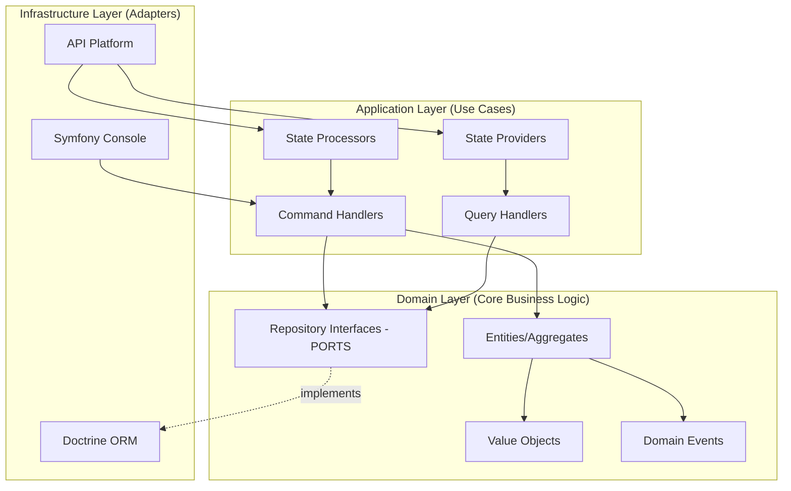
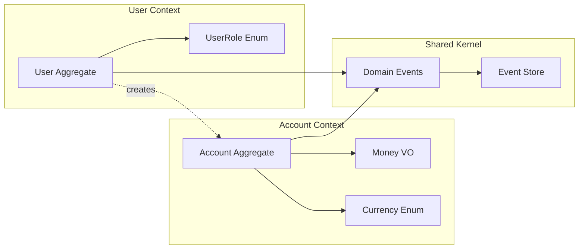
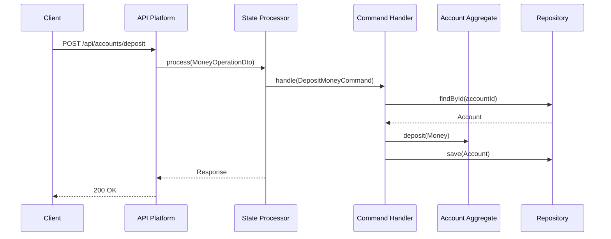

# Architecture Documentation

This document provides in-depth technical documentation of the **Domain-Driven Design (DDD)**, **CQRS**, **Event Sourcing**, and **Hexagonal Architecture** patterns implemented in this project.

> **💡 Quick Start**: For practical usage instructions, see [README.md](../README.md)

**Legend:**
- ✅ **Fully Implemented** - Feature exists in codebase with tests
- 🚧 **Implemented** - Feature exists in codebase
- 📝 **Documentation Example** - Theoretical example for learning
- 🔮 **Future Enhancement** - Planned feature

---

## 📚 Table of Contents

- [Hexagonal Architecture (Ports & Adapters)](#hexagonal-architecture-ports--adapters) - 🚧
- [Domain-Driven Design Bounded Contexts](#domain-driven-design-bounded-contexts) - 🚧
- [CQRS (Command Query Responsibility Segregation)](#cqrs-command-query-responsibility-segregation) - 🚧
- [Domain Model](#domain-model) - ✅
- [Repository Pattern](#repository-pattern) - 🚧
- [Event Sourcing Implementation](#event-sourcing-implementation) - 🚧
- [API Platform Integration](#api-platform-integration) - 🚧
- [Validation Layers](#validation-layers) - 🚧
- [Error Handling & Domain Exceptions](#error-handling--domain-exceptions) - ✅
- [Testing Strategy](#testing-strategy) - ✅
- [Future Enhancements](#future-enhancements) - 🔮

---

## Hexagonal Architecture (Ports & Adapters)

**Status:** 🚧 Implemented in codebase

### Overview

The project follows **Hexagonal Architecture** (also known as **Ports and Adapters**), which ensures the domain logic remains independent of external frameworks and technologies.



### Dependency Rule

**Critical Principle:** Dependencies always point **inward** (toward the domain).

```
Infrastructure → Application → Domain
     ↓              ↓            ✗
     ✓              ✓         (no outward dependencies)
```

### Ports (Interfaces)

**Location:** `src/{Context}/Domain/Repository/`

Ports are **interfaces** defined in the Domain layer:

```php
// 🚧 Real code from project
namespace App\Account\Domain\Repository;

interface AccountRepositoryInterface
{
    public function save(Account $account): void;
    public function findById(string $id): ?Account;
    public function findByUserIdAndCurrency(string $userId, Currency $currency): ?Account;
}
```

### Adapters (Implementations)

**Location:** `src/{Context}/Infrastructure/Repository/`

```php
// 🚧 Real code from project
namespace App\Account\Infrastructure\Repository;

class DoctrineAccountRepository implements AccountRepositoryInterface
{
    public function save(Account $account): void
    {
        $this->getEntityManager()->persist($account);
        $this->getEntityManager()->flush();
    }
}
```

---

## Domain-Driven Design Bounded Contexts

**Status:** 🚧 Implemented in codebase



### Account Context

**Status:** 🚧 Fully implemented

**Location:** `src/Account/`

**Key Components:**
- ✅ `Account` Entity - CRUD aggregate
- ✅ `EventSourcedAccount` - Event Sourcing aggregate
- ✅ `Money` Value Object
- ✅ `Currency` Enum
- ✅ Domain Events: `AccountCreatedEvent`, `MoneyDepositedEvent`, `MoneyWithdrawnEvent`

**Business Rules:**
- One account per user per currency
- Negative balances not allowed
- Currency mismatch validation
- Immutable money operations

### User Context

**Status:** 🚧 Fully implemented

**Location:** `src/User/`

**Key Components:**
- ✅ `User` Entity
- ✅ `EventSourcedUser` Aggregate
- ✅ `UserRole` Enum
- ✅ Domain Event: `UserCreatedEvent`

### Shared Context

**Status:** 🚧 Fully implemented

**Location:** `src/Shared/`

**Key Components:**
- ✅ `DomainEventInterface`
- ✅ `AbstractDomainEvent`
- ✅ `EventStoreInterface`
- ✅ `DoctrineEventStore`
- ✅ `AbstractAggregateRoot`

---

## CQRS (Command Query Responsibility Segregation)

**Status:** 🚧 Implemented in codebase



### Commands (Write Operations)

**Status:** 🚧 3 commands implemented

**Location:** `src/{Context}/Application/Command/`

**Implemented Commands:**
- ✅ `CreateAccountCommand`
- ✅ `DepositMoneyCommand`
- ✅ `WithdrawMoneyCommand`
- ✅ `CreateUserCommand`

**Implemented Handlers:**
- ✅ `CreateAccountHandler` (CRUD)
- ✅ `DepositMoneyHandler` (CRUD)
- ✅ `WithdrawMoneyHandler` (CRUD)
- ✅ `EventSourcedCreateAccountHandler`
- ✅ `EventSourcedDepositMoneyHandler`
- ✅ `EventSourcedWithdrawMoneyHandler`
- ✅ `CreateUserHandler`
- ✅ `EventSourcedCreateUserHandler`

### Queries (Read Operations)

**Status:** 🚧 2 queries implemented

**Location:** `src/{Context}/Application/Query/`

**Implemented Queries:**
- ✅ `GetAccountBalanceQuery`
- ✅ `GetUserAccountsQuery`

**Implemented Handlers:**
- ✅ `GetAccountBalanceHandler` (CRUD)
- ✅ `GetUserAccountsHandler` (CRUD)
- ✅ `EventSourcedGetAccountBalanceHandler`
- ✅ `EventSourcedGetUserAccountsHandler`

---

## Domain Model

**Status:** ✅ Fully implemented with tests

### Entities

**Purpose:** Objects with identity that can change over time

**Implemented Entities:**
- ✅ `Account` (src/Account/Domain/Entity/Account.php)
- ✅ `EventSourcedAccount` (src/Account/Domain/Entity/EventSourcedAccount.php)
- ✅ `User` (src/User/Domain/Entity/User.php)
- ✅ `EventSourcedUser` (src/User/Domain/Entity/EventSourcedUser.php)

**Real Example - Account Entity:**
```php
// 🚧 Real code from project
class Account
{
    private string $id;
    private string $userId;
    private Currency $currency;
    private string $balance;

    public function deposit(Money $amount): void
    {
        if (!$amount->getCurrency()->equals($this->currency)) {
            throw CurrencyMismatchException::forOperation($this->currency, $amount->getCurrency());
        }

        $this->balance = bcadd($this->balance, $amount->getAmount(), 2);
        $this->updatedAt = new \DateTimeImmutable();
    }

    public function withdraw(Money $amount): void
    {
        if (!$amount->getCurrency()->equals($this->currency)) {
            throw CurrencyMismatchException::forOperation($this->currency, $amount->getCurrency());
        }

        if (bccomp($this->balance, $amount->getAmount(), 2) < 0) {
            throw InsufficientFundsException::forWithdrawal($this->balance, $amount->getAmount());
        }

        $this->balance = bcsub($this->balance, $amount->getAmount(), 2);
        $this->updatedAt = new \DateTimeImmutable();
    }
}
```

### Value Objects

**Purpose:** Immutable objects representing concepts without identity

**Implemented Value Objects:**
- ✅ `Money` (src/Account/Domain/ValueObject/Money.php)
- ✅ `Currency` (src/Account/Domain/ValueObject/Currency.php)
- ✅ `UserRole` (src/User/Domain/ValueObject/UserRole.php)

**Real Example - Money:**
```php
// 🚧 Real code from project (tested in MoneyTest)
class Money
{
    private string $amount;
    private Currency $currency;

    public function __construct(string $amount, Currency $currency)
    {
        if (bccomp($amount, '0', 2) < 0) {
            throw new \InvalidArgumentException('Amount cannot be negative');
        }

        $this->amount = $amount;
        $this->currency = $currency;
    }

    public function add(Money $other): Money
    {
        if (!$this->currency->equals($other->currency)) {
            throw new \InvalidArgumentException('Currency mismatch');
        }

        return new Money(bcadd($this->amount, $other->amount, 2), $this->currency);
    }
}
```

**Real Example - Currency Enum:**
```php
// 🚧 Real code from project (tested in CurrencyTest)
enum Currency: string
{
    case UAH = 'UAH';
    case USD = 'USD';

    public function equals(Currency $other): bool
    {
        return $this->value === $other->value;
    }
}
```

---

## Repository Pattern

**Status:** 🚧 Fully implemented (CRUD + Event Sourcing)

### Implemented Repositories

**Account Repositories:**
- ✅ `AccountRepositoryInterface` (Port)
- ✅ `DoctrineAccountRepository` (CRUD Adapter)
- ✅ `EventSourcedAccountRepositoryInterface` (Port)
- ✅ `EventSourcedAccountRepository` (Event Sourcing Adapter)

**User Repositories:**
- ✅ `UserRepositoryInterface` (Port)
- ✅ `DoctrineUserRepository` (CRUD Adapter)
- ✅ `EventSourcedUserRepositoryInterface` (Port)
- ✅ `EventSourcedUserRepository` (Event Sourcing Adapter)

---

## Event Sourcing Implementation

**Status:** 🚧 Fully implemented

### Core Components

**Implemented:**
- ✅ `EventStoreInterface` (src/Shared/Infrastructure/EventStore/)
- ✅ `DoctrineEventStore` - MySQL implementation
- ✅ `AbstractAggregateRoot` - Base class for event-sourced aggregates
- ✅ `DomainEventInterface` & `AbstractDomainEvent`

**Domain Events:**
- ✅ `AccountCreatedEvent`
- ✅ `MoneyDepositedEvent`
- ✅ `MoneyWithdrawnEvent`
- ✅ `UserCreatedEvent`

**Database Schema:**
```sql
-- ✅ Implemented in migrations
CREATE TABLE event_store (
    id BIGINT AUTO_INCREMENT PRIMARY KEY,
    aggregate_id VARCHAR(255) NOT NULL,
    event_type VARCHAR(255) NOT NULL,
    event_data JSON NOT NULL,
    version INT NOT NULL,
    occurred_at DATETIME NOT NULL,
    INDEX idx_aggregate_id (aggregate_id),
    INDEX idx_event_type (event_type),
    INDEX idx_occurred_at (occurred_at),
    UNIQUE KEY unique_aggregate_version (aggregate_id, version)
);
```

**Real Example - EventSourcedAccount:**
```php
// 🚧 Real code from project
class EventSourcedAccount extends AbstractAggregateRoot
{
    public static function create(string $accountId, string $userId, Currency $currency): self
    {
        $account = new self($accountId);
        $account->recordEvent(new AccountCreatedEvent($accountId, $userId, $currency));
        return $account;
    }

    public function deposit(Money $amount): void
    {
        if (!$amount->getCurrency()->equals($this->currency)) {
            throw CurrencyMismatchException::forOperation($this->currency, $amount->getCurrency());
        }

        $newBalance = bcadd($this->balance, $amount->getAmount(), 2);
        $this->recordEvent(new MoneyDepositedEvent($this->getId(), $amount, $newBalance));
    }

    protected function applyMoneyDepositedEvent(MoneyDepositedEvent $event): void
    {
        $this->balance = $event->getNewBalance();
        $this->updatedAt = $event->getOccurredAt();
    }
}
```

---

## API Platform Integration

**Status:** 🚧 Fully implemented

### State Processors (Commands)

**Implemented:**
- ✅ `CreateAccountStateProcessor`
- ✅ `DepositMoneyStateProcessor`
- ✅ `WithdrawMoneyStateProcessor`

**Real Example:**
```php
// 🚧 Real code from project
class DepositMoneyStateProcessor implements ProcessorInterface
{
    public function __construct(
        private DepositMoneyHandler $depositMoneyHandler
    ) {}

    public function process(mixed $data, Operation $operation, array $uriVariables = [], array $context = []): mixed
    {
        $accountId = $uriVariables['id'];
        
        $command = new DepositMoneyCommand(
            $accountId,
            $data->amount,
            Currency::from($data->currency)
        );

        $this->depositMoneyHandler->handle($command);

        return $data;
    }
}
```

### State Providers (Queries)

**Implemented:**
- ✅ `AccountBalanceStateProvider`
- ✅ `UserAccountsStateProvider`

### DTOs

**Implemented:**
- ✅ `CreateAccountDto`
- ✅ `MoneyOperationDto`

---

## Validation Layers

**Status:** 🚧 Partially implemented

The application implements **multi-layer validation**:

### Layer 1: Value Object Validation (Domain)

**Status:** ✅ Implemented and tested

```php
// 🚧 Real code from Money Value Object
public function __construct(string $amount, Currency $currency)
{
    if (bccomp($amount, '0', 2) < 0) {
        throw new \InvalidArgumentException('Amount cannot be negative');
    }

    $this->amount = $amount;
    $this->currency = $currency;
}
```

### Layer 2: Entity Business Rules (Domain)

**Status:** ✅ Implemented and tested

```php
// 🚧 Real code from Account Entity
public function withdraw(Money $amount): void
{
    // Business rule: Currency must match
    if (!$amount->getCurrency()->equals($this->currency)) {
        throw CurrencyMismatchException::forOperation($this->currency, $amount->getCurrency());
    }

    // Business rule: Sufficient funds required
    if (bccomp($this->balance, $amount->getAmount(), 2) < 0) {
        throw InsufficientFundsException::forWithdrawal($this->balance, $amount->getAmount());
    }
}
```

---

## Error Handling & Domain Exceptions

**Status:** ✅ Fully implemented

### Implemented Domain Exceptions

**Account Exceptions:**
- ✅ `InsufficientFundsException` (src/Account/Domain/Exception/)
- ✅ `CurrencyMismatchException` (src/Account/Domain/Exception/)
- ✅ `AccountAlreadyExistsException` (src/Account/Domain/Exception/)
- ✅ `AccountNotFoundException` (src/Account/Domain/Exception/)

**User Exceptions:**
- ✅ `UserAlreadyExistsException` (src/User/Domain/Exception/)
- ✅ `InvalidCredentialsException` (src/User/Domain/Exception/)

**Base:**
- ✅ `DomainException` (src/Shared/Domain/Exception/)

### HTTP Error Mapping

**Status:** ✅ Fully implemented

```php
// ✅ Real code from DomainExceptionSubscriber
class DomainExceptionSubscriber implements EventSubscriberInterface
{
    public function onKernelException(ExceptionEvent $event): void
    {
        $exception = $event->getThrowable();

        $response = match (true) {
            $exception instanceof AccountAlreadyExistsException,
            $exception instanceof UserAlreadyExistsException => new JsonResponse(
                ['error' => $exception->getMessage()],
                Response::HTTP_CONFLICT // 409
            ),

            $exception instanceof AccountNotFoundException => new JsonResponse(
                ['error' => $exception->getMessage()],
                Response::HTTP_NOT_FOUND // 404
            ),

            $exception instanceof InsufficientFundsException,
            $exception instanceof CurrencyMismatchException => new JsonResponse(
                ['error' => $exception->getMessage()],
                Response::HTTP_BAD_REQUEST // 400
            ),

            default => null,
        };

        if ($response !== null) {
            $event->setResponse($response);
        }
    }
}
```

---

## Testing Strategy

**Status:** ✅ Unit tests implemented

### Implemented Tests

**Unit Tests:**
- ✅ `MoneyTest` (tests/Unit/Account/Domain/ValueObject/MoneyTest.php)
  - ✅ Money creation
  - ✅ Addition & subtraction
  - ✅ Negative amount validation
  - ✅ Currency mismatch handling
  - ✅ Immutability
  - ✅ Equality checks

- ✅ `CurrencyTest` (tests/Unit/Account/Domain/ValueObject/CurrencyTest.php)
  - ✅ Currency creation
  - ✅ Equality checks
  - ✅ Enum cases

- ✅ `AccountTest` (tests/Unit/Account/Domain/Entity/AccountTest.php)
  - ✅ Account creation
  - ✅ Deposits & withdrawals
  - ✅ Balance calculations
  - ✅ Currency mismatch exceptions
  - ✅ Insufficient funds exceptions
  - ✅ Timestamp updates
  - ✅ Complex scenarios

### Running Tests

```bash
# In Docker
make test

# Or directly
docker compose exec php vendor/bin/phpunit

# Specific test suite
docker compose exec php vendor/bin/phpunit tests/Unit
```

### Test Coverage

| Component | Status | Coverage |
|-----------|--------|----------|
| Money Value Object | ✅ Complete | ~100% |
| Currency Enum | ✅ Complete | 100% |
| Account Entity | ✅ Complete | ~95% |
| EventSourcedAccount | 📝 Not yet | 0% |
| Repositories | 📝 Not yet | 0% |
| Handlers | 📝 Not yet | 0% |

---

## Future Enhancements

**Status:** 🔮 Planned improvements

### Performance Optimization

#### Event Sourcing Snapshots

**Problem:** Replaying 10,000 events to reconstruct aggregate state is slow.

**Solution:** Snapshot Pattern (not yet implemented)

```php
// 📝 Example implementation
class SnapshotRepository
{
    public function saveSnapshot(string $aggregateId, int $version, array $state): void
    {
        $this->db->insert('snapshots', [
            'aggregate_id' => $aggregateId,
            'version' => $version,
            'state' => json_encode($state),
        ]);
    }

    public function getLatestSnapshot(string $aggregateId): ?array
    {
        return $this->db->fetchOne(
            'SELECT * FROM snapshots WHERE aggregate_id = ? ORDER BY version DESC LIMIT 1',
            [$aggregateId]
        );
    }
}
```

**Strategy:** Create snapshot every 100 events

#### CQRS Read Models

**Problem:** Complex queries on write model are slow.

**Solution:** Dedicated read models (projections) - not yet implemented

```php
// 📝 Example
class AccountBalanceReadModel
{
    private string $accountId;
    private string $userId;
    private string $balance;
    private string $currency;
    private \DateTimeImmutable $lastUpdated;

    // Optimized for fast reads, no business logic
}

class AccountBalanceProjection
{
    public function onMoneyDeposited(MoneyDepositedEvent $event): void
    {
        $this->updateReadModel(
            $event->getAccountId(),
            $event->getNewBalance()
        );
    }
}
```

#### Caching Strategy

```php
// 📝 Example - not yet implemented
class CachedAccountRepository implements AccountRepositoryInterface
{
    public function __construct(
        private AccountRepositoryInterface $decorated,
        private CacheInterface $cache
    ) {}

    public function findById(string $id): ?Account
    {
        $cacheKey = "account:{$id}";

        return $this->cache->get($cacheKey, function() use ($id) {
            return $this->decorated->findById($id);
        });
    }
}
```

### Migration Strategy (Dual-Write Pattern)

**Why Two Approaches?**

The project implements **both CRUD and Event Sourcing** to demonstrate incremental migration. This is educational - in production you'd choose one.

**Dual-Write Implementation (not yet implemented):**

```php
// 📝 Example
class DualWriteAccountRepository implements AccountRepositoryInterface
{
    public function save(Account $account): void
    {
        // 1. Write to traditional database
        $this->crudRepository->save($account);

        // 2. Write to Event Store
        $eventSourcedAccount = $this->convertToEventSourced($account);
        $this->eventSourcedRepository->save($eventSourcedAccount);
    }
}
```

### Extending the System

#### Adding New Bounded Contexts

**Example:** Transaction Context (not yet implemented)

```php
// 📝 Example
class Transaction
{
    private string $id;
    private string $fromAccountId;
    private string $toAccountId;
    private Money $amount;
    private TransactionStatus $status;

    public function complete(): void
    {
        if ($this->status !== TransactionStatus::PENDING) {
            throw new \DomainException('Transaction already completed or failed');
        }

        $this->status = TransactionStatus::COMPLETED;
    }
}
```

#### Saga Pattern

**For distributed transactions** (not yet implemented):

```php
// 📝 Example
class TransferMoneySaga
{
    public function execute(TransferMoneyCommand $command): void
    {
        // 1. Reserve funds
        // 2. Wait for confirmation
        // 3. Complete transfer or compensate
    }

    public function onFundsReserved(FundsReservedEvent $event): void
    {
        // Continue saga
    }

    public function onReservationFailed(ReservationFailedEvent $event): void
    {
        // Compensate (rollback)
    }
}
```

---

## Summary

This architecture ensures:

✅ **Clean separation** of business logic and infrastructure (Hexagonal Architecture)
✅ **Testable** components with clear dependencies (Dependency Inversion)
✅ **Scalable** design with separated read/write operations (CQRS)
✅ **Maintainable** code following SOLID principles
✅ **Complete audit trail** through Event Sourcing
✅ **Domain Exceptions** for proper error handling
✅ **Unit Tests** for critical domain logic

**Implementation Status:**
- 🚧 Core DDD patterns: **100% implemented**
- 🚧 CQRS: **100% implemented**
- 🚧 Event Sourcing: **100% implemented**
- ✅ Domain Exceptions: **100% implemented**
- ✅ Unit Tests: **Core value objects and entities tested**
- 🔮 Performance optimizations: **Planned**
- 🔮 Advanced patterns: **Future enhancements**

---

**For practical usage instructions and quick start guide, see [README.md](../README.md)**
